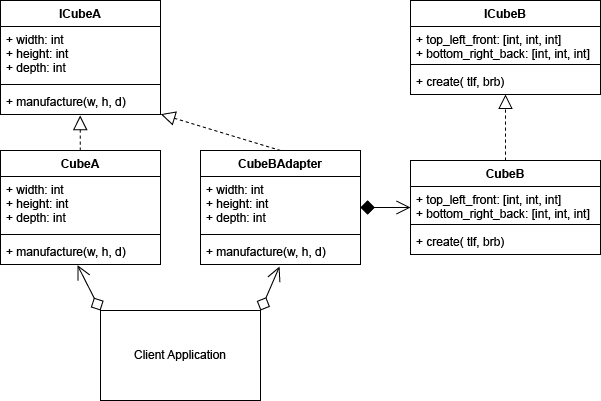

# Шаблони проектування. Структурні шаблони

## Мета

Освоїти роботу з структурними шаблонами в Python3.

## Структурні шаблони

 Структурні шаблони – шаблони проектування, в яких розглядається питання про те, як з класів і об’єктів утворюються більші структури. Вони відповідають за побудову зручних в підтримці ієрархій класів.

## Шаблон адаптер (Adapter)

Адаптер — це структурний патерн проектування, що дає змогу об’єктам із несумісними інтерфейсами працювати разом. Адаптер загортає один з об’єктів так, що інший об’єкт навіть не підозрює про існування першого. Наприклад, об’єкт, що працює в метричній системі вимірювання, можна «обгорнути» адаптером, який буде конвертувати дані у фути.

Адаптери можуть не тільки конвертувати дані з одного формату в іншій, але й допомагати об’єктам із різними інтерфейсами працювати разом. Це виглядає так:

* Адаптер має інтерфейс, сумісний з одним із об’єктів.
* Тому цей об’єкт може вільно викликати методи адаптера.
* Адаптер отримує ці виклики та перенаправляє їх іншому об’єкту, але вже в тому форматі та послідовності, які є зрозумілими для цього об’єкта.

## Приклад коду

```python
import time
import random
from abc import ABCMeta, abstractmethod


class ICubeA(metaclass=ABCMeta):
    "An interface for an object"
    @staticmethod
    @abstractmethod
    def manufacture(width, height, depth):
        "manufactures a cube"


class ICubeB(metaclass=ABCMeta):
    "An interface for an object"
    @staticmethod
    @abstractmethod
    def create(top_left_front, bottom_right_back):
        "Manufactures a Cube with coords offset [0, 0, 0]"


class CubeA(ICubeA):
    "A hypothetical Cube tool from company A"
    # a static variable indicating the last time a cube was manufactured
    last_time = int(time.time())

    def __init__(self):
        self.width = self.height = self.depth = 0

    def manufacture(self, width, height, depth):
        self.width = width
        self.height = height
        self.depth = depth
        # if not busy, then manufacture a cube with dimensions
        now = int(time.time())
        if now > int(CubeA.last_time + 1):
            CubeA.last_time = now
            return True
        return False  # busy


class CubeB(ICubeB):
    "A hypothetical Cube tool from company B"
    # a static variable indicating the last time a cube was manufactured
    last_time = int(time.time())

    def create(self, top_left_front, bottom_right_back):
        now = int(time.time())
        if now > int(CubeB.last_time + 2):
            CubeB.last_time = now
            return True
        return False  # busy


"A Class of Cube from Company A"


class CubeA(ICubeA):
    "A hypothetical Cube tool from company A"
    # a static variable indicating the last time a cube was manufactured
    last_time = int(time.time())

    def __init__(self):
        self.width = self.height = self.depth = 0

    def manufacture(self, width, height, depth):
        self.width = width
        self.height = height
        self.depth = depth
        # if not busy, then manufacture a cube with dimensions
        now = int(time.time())
        if now > int(CubeA.last_time + 1):
            CubeA.last_time = now
            return True
        return False  # busy


"A Class of Cube from Company B"


class CubeBAdapter(ICubeA):
    "Adapter for CubeB that implements ICubeA"

    def __init__(self):
        self.cube = CubeB()
        self.width = self.height = self.depth = 0

    def manufacture(self, width, height, depth):
        self.width = width
        self.height = height
        self.depth = depth

        success = self.cube.create(
            [0-width/2, 0-height/2, 0-depth/2],
            [0+width/2, 0+height/2, 0+depth/2]
        )
        return success


# client
TOTALCUBES = 5
COUNTER = 0
while COUNTER < TOTALCUBES:
    # produce 5 cubes from which ever supplier can manufacture it first
    WIDTH = random.randint(1, 10)
    HEIGHT = random.randint(1, 10)
    DEPTH = random.randint(1, 10)
    CUBE = CubeA()
    SUCCESS = CUBE.manufacture(WIDTH, HEIGHT, DEPTH)
    if SUCCESS:
        print(
            f"Company A building Cube id:{id(CUBE)}, "
            f"{CUBE.width}x{CUBE.height}x{CUBE.depth}")
        COUNTER = COUNTER + 1
    else:  # try other manufacturer
        print("Company A is busy, trying company B")
        CUBE = CubeBAdapter()
        SUCCESS = CUBE.manufacture(WIDTH, HEIGHT, DEPTH)
        if SUCCESS:
            print(
                f"Company B building Cube id:{id(CUBE)}, "
                f"{CUBE.width}x{CUBE.height}x{CUBE.depth}")
            COUNTER = COUNTER + 1
        else:
            print("Company B is busy, trying company A")
    # wait some time before manufacturing a new cube
    time.sleep(1)

print(f"{TOTALCUBES} cubes have been manufactured")


```

## Вивід
>Company A is busy, trying company B <br />
>Company B is busy, trying company A <br />
>Company A is busy, trying company B <br />
>Company B is busy, trying company A <br />
>Company A building Cube id:1377381886464, 2x4x1 <br />
>Company A is busy, trying company B <br />
>Company B building Cube id:1377381886464, 8x10x7 <br />
>Company A building Cube id:1377381886320, 2x2x9 <br />
>Company A is busy, trying company B <br />
>Company B is busy, trying company A <br /> 
>Company A building Cube id:1377381886464, 4x8x7 <br />
>Company A is busy, trying company B <br />
>Company B building Cube id:1377381886464, 10x8x8 <br />
>5 cubes have been manufactured

## UML-діаграма 



## Висновок

Адаптер дозволяє створити об’єкт-прокладку, який перетворюватиме виклики програми у формат, зрозумілий сторонньому класу.
#### Переваги
* Відокремлює та приховує від клієнта подробиці перетворення різних інтерфейсів.
#### Недоліки
* Ускладнює код програми внаслідок введення додаткових класів.

