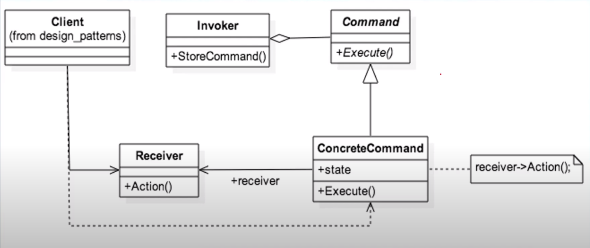

# Шаблони проектування. Поведінкові патерни

## Мета

Освоїти роботу з поведінковими шаблонами в Python3.

## Поведінкові шаблони

Шаблони поведінки (англ. behavioral patterns) — шаблони проєктування, що пов'язані з алгоритмами та розподілом обов'язків поміж об'єктів. Мова в них йде не тільки 
про самі об'єкти та класи, але й про типові способи їхньої взаємодії. Шаблони поведінки характеризують складний потік керування, котрий досить важко прослідкувати під 
час виконання програми. Увага акцентована не на потоці керування, а на зв'язках між об'єктами.

## Шаблон Command

Command - Інкапсулює запит у формі об'єкта, дозволяючи тим самим задавати параметри клієнтів для обробки відповідних запитів, ставити запити 
у чергу або протоколювати їх, а також підтримувати скасовування операцій.

## Приклад коду

```python
class SingletonBaseClass(type):
    _instances = {}

    def __call__(cls):
        if cls not in cls._instances:
            cls._instances[cls] = super(SingletonBaseClass, cls).\
                __call__()
        return cls._instances[cls]


class MySingleton(metaclass=SingletonBaseClass):
    def __init__(self):
        self.name = "Singleton"
        self.value_a = 3
        self.value_b = 5

    def add_a_b(self) -> int:
        return self.value_a+self.value_b

    def get_name(self) -> str:
        return self.name

    def set_name(self, name: str):
        self.name = name

if __name__ == "__main__":
    my_singleton1 = MySingleton()
    my_singleton2 = MySingleton()
    print("Singleton1 name: " + my_singleton1.get_name())
    my_singleton1.set_name("New Singleton")
    print("Singleton2 name: " + my_singleton2.get_name())
    print(my_singleton1)
    print(my_singleton2)
    print(id(my_singleton1) == id(my_singleton2))
```

## Вивід
>Асистент готує тісто для піци
>Шеф розгортає основу для піци
>Піч розігрівається
>Асистент нарізає начинку для піци
>Шеф додає начинку на піцу
>Піца готується в печі

## UML-діаграма 



## Висновок

Команда (Command) – дозволяє інкапсулювати всю інформацію, необхідну для виконання певних операцій, які можуть 
бути виконані пізніше, використавши об’єкт команди;

#### Переваги
- Доволі легко організувати операції відміни, повторення а також відкладений запуск
- Можно збирати складні команди з простих
#### Недоліки
- Вводиться велика кількість допоміжних класів, що створює проблеми орієнтації в коді

